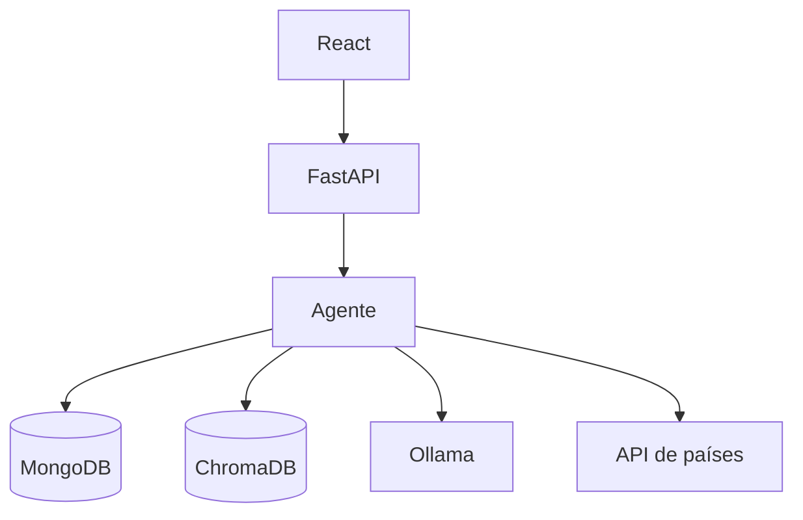

# Asistente IA con FastAPI y React

[](https://github.com/macervilla/asistente_ia/actions/workflows/ci.yml)
[](https://codecov.io/gh/macervilla/asistente_ia)

Asistente conversacional desarrollado como práctica de **IA Engineering**. El sistema combina un backend en FastAPI, una interfaz de chat en React, memoria conversacional en MongoDB, búsqueda semántica con ChromaDB y generación local mediante Ollama.

## Funcionalidades

- Chat visual conectado con FastAPI.
- Historial de conversaciones almacenado en MongoDB.
- Carga y consulta de documentos PDF mediante RAG.
- Embeddings y búsqueda vectorial con ChromaDB.
- Respuestas generadas localmente con Ollama.
- Consulta de información de países mediante una API externa.
- Selección automática de la herramienta adecuada para cada pregunta.
- Pruebas automatizadas aisladas mediante mocks.
- Pipeline de integración continua y cobertura con GitHub Actions y Codecov.

## Herramientas del agente

| Herramienta | Uso |
|---|---|
| `documentos` | Consulta información de un PDF cargado en ChromaDB. |
| `mongodb` | Recupera información del historial conversacional. |
| `api_externa` | Consulta información pública de países. |
| `directa` | Genera una respuesta general mediante Ollama. |

## Arquitectura



## Tecnologías

- Python, FastAPI y Uvicorn.
- React y Vite.
- MongoDB.
- ChromaDB.
- Ollama.
- PyMuPDF.
- Pytest, mocks y pytest-cov.
- Docker Compose.
- GitHub Actions y Codecov.

## Requisitos

- Python 3.13 o compatible.
- Node.js 22 o compatible.
- Docker Desktop o una instancia accesible de MongoDB.
- Ollama con el modelo configurado por la aplicación.

## Instalación del backend

Desde la raíz del proyecto:

```bash
python -m venv venv
```

Activación en Windows:

```powershell
venv\Scripts\activate
```

Instalación de dependencias:

```bash
pip install -r requirements.txt
```

Creá el archivo `.env` con las variables utilizadas por la aplicación. Este archivo está excluido del repositorio para evitar publicar credenciales.

## MongoDB

Definí `MONGO_USUARIO` y `MONGO_PASSWORD` en `.env` y levantá el contenedor:

```bash
docker compose up -d
```

## Ejecución

Backend:

```bash
uvicorn app.main:app --reload
```

Documentación interactiva:

```text
http://127.0.0.1:8000/docs
```

Frontend:

```bash
cd frontend
npm install
npm run dev
```

Interfaz:

```text
http://localhost:5173
```

## Pruebas automatizadas

Las dependencias externas se reemplazan por mocks, por lo que los tests no necesitan realizar consultas reales a Ollama, ChromaDB, MongoDB ni la API de países.

```bash
pip install -r requirements-test.txt
python -m pytest tests/test_agente_service.py -v
```

Para generar la cobertura local:

```bash
python -m pytest tests/test_agente_service.py -v --cov=app --cov-report=term-missing --cov-report=xml
```

## CI/CD y Codecov

El workflow `.github/workflows/ci.yml` se ejecuta con cada `push` y `pull request` sobre `main`:

1. Instala las dependencias de Python.
2. Ejecuta los tests del agente.
3. Genera `coverage.xml`.
4. Publica la cobertura en Codecov.
5. Instala las dependencias del frontend con `npm ci`.
6. Compila React y conserva `frontend/dist` como artefacto en los pushes a `main`.

La publicación automática en un servidor no está habilitada: el proyecto genera un artefacto listo para una futura etapa de despliegue, sin modificar el VPS actual.

## Estructura principal

```text
asistente_ia/
├── app/
│   ├── routers/
│   ├── services/
│   └── main.py
├── frontend/
│   ├── src/
│   ├── package.json
│   └── package-lock.json
├── tests/
│   └── test_agente_service.py
├── .github/workflows/ci.yml
├── docker-compose.yml
├── requirements.txt
└── requirements-test.txt
```

## Estado del proyecto

- Backend y frontend funcionales en entorno local.
- Carga y consulta de PDF desde la interfaz.
- Cuatro herramientas del agente verificadas.
- Seis pruebas automatizadas aprobadas.
- Despliegue en VPS postergado para evitar ejecutar Ollama en un servidor de 4 GB compartido con otros sistemas.
